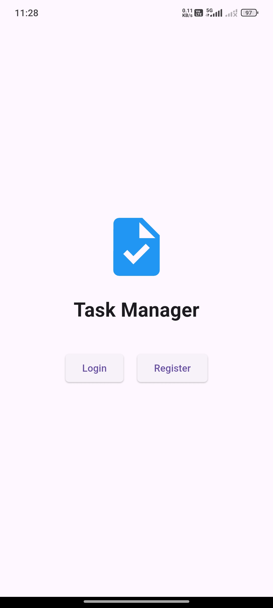
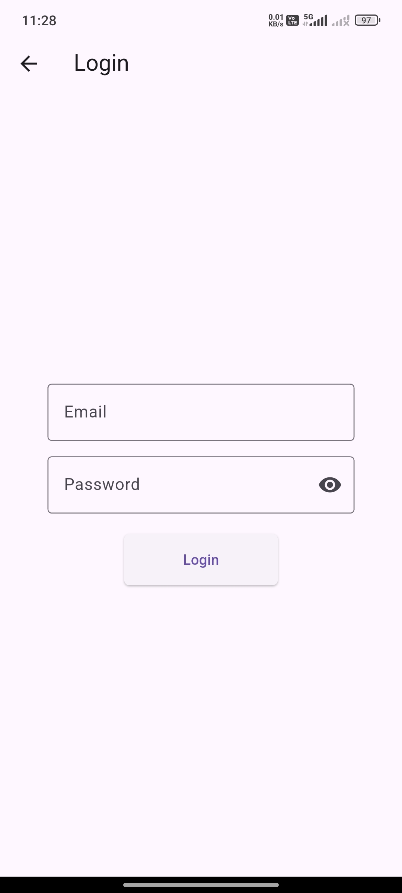
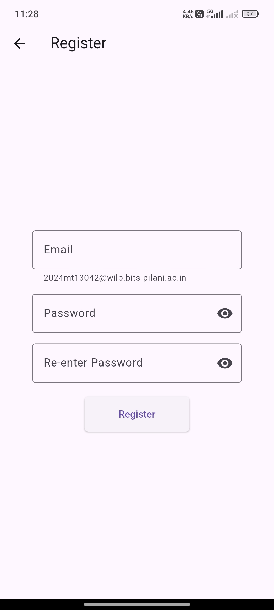
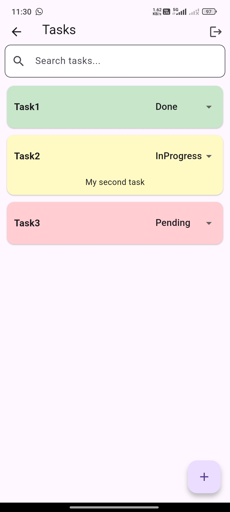
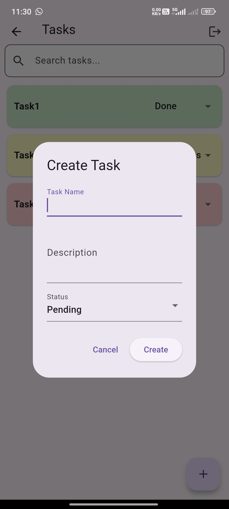
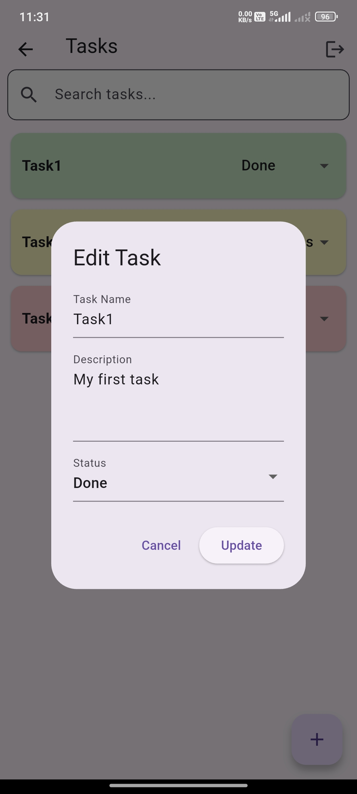
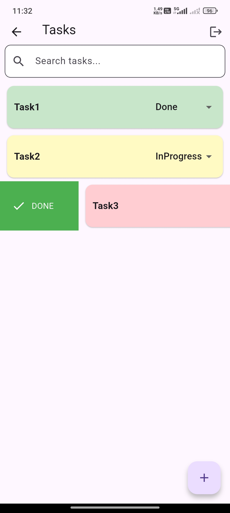
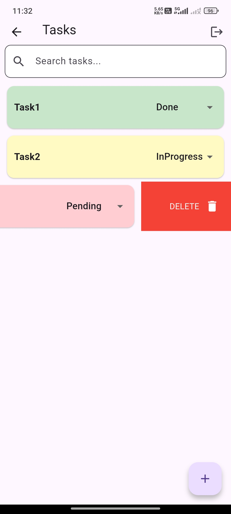
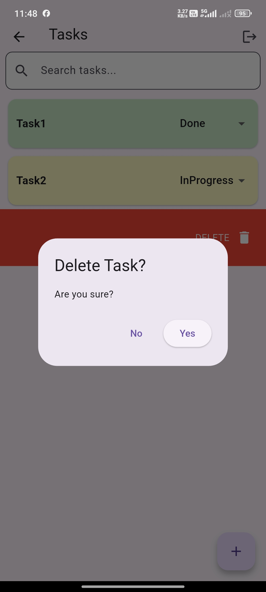

# 📱 Task Manager App (Flutter + Back4App)

A fully functional **Task Manager Mobile Application** built using **Flutter** and powered by **Back4App (Parse Server)** as Backend-as-a-Service (BaaS).

This app allows users to **register, login, and manage tasks (CRUD operations)** with real-time synchronization and a smooth user experience.

---

## 🚀 Features

### 🔐 Authentication
- User Registration (Student Email ID)
- Secure Login & Logout
- Session Persistence (Stay Logged In)

### 📝 Task Management (CRUD)
- ➕ Create Task (Title + Description)
- 📖 View Tasks (Fetched from Back4App)
- ✏️ Update Task
- ❌ Delete Task

### 🔄 Real-Time Sync
- Instant updates in UI
- Synced with Back4App cloud database

---

## 🛠️ Tech Stack

| Layer        | Technology |
|-------------|-----------|
| Frontend     | Flutter (Dart) |
| Backend      | Back4App (Parse Server) |
| Database     | Back4App Cloud DB |
| Version Ctrl | GitHub |
| Deployment   | Android Emulator / Device |

---

## 📱 Application Flow

### 🔑 Authentication Flow
1. User opens the app
2. If not logged in → Login/Register screen
3. If logged in → Redirect to Task Dashboard

### 📋 Task Flow
1. View task list
2. Add new task
3. Edit/Delete task
4. Auto-sync with backend

### 🚪 Logout Flow
1. User clicks logout
2. Session cleared
3. Redirect to home screen

---

## 📸 App Screenshots

> 📌 Replace these image paths with actual screenshots from your repo

### 🏠 Home Page


### 🔐 Login Page


### 📝 Register Page



### 📋 Tasks Dashboard


### ➕ Add Task


### ✏️ Update Task



### ✅ Task Status Update (Swipe Right)


### ❌ Delete Task (Swipe Left)


### ⚠️ Confirm Delete Popup


---

## ✨ Additional Enhancements

- 🔍 Search Tasks
- 🔄 Pull-to-Refresh
- 📳 Haptic Feedback
- ✔️ Swipe Actions (Done/Delete)
- 🧠 Session Validation
- 🎯 Task Filtering (User-specific)
- ⚡ Real-time UI updates
- 🧾 Input Validation

---

## 📊 Architecture Overview

- Flutter handles UI & state
- Back4App manages:
    - Authentication
    - Database
    - APIs
- No custom backend required

---

## 🎯 Why Back4App?

- ✅ No backend setup needed
- 🔐 Built-in authentication
- ☁️ Scalable cloud database
- ⚡ Faster development

---

## 🧪 Challenges Faced

- Authentication handling
- API integration
- State management
- Real-time synchronization

---

## 📚 Learnings

- Flutter + Backend integration
- Working with BaaS (Back4App)
- CRUD operations in real apps
- Mobile app design flow

---

## 🔮 Future Enhancements

- 🔔 Push Notifications
- ⏰ Task Deadlines
- 🏷️ Priority Tagging
- 🌙 Dark Mode
- 📶 Offline Support

---

## ▶️ Setup Instructions

### 1️ Clone the Repository
```bash
git clone https://github.com/akhilesh1201/task_manager_app.git
cd task_manager_app
```

### 2 Install Dependencies
```bash
flutter pub get
```

### 3 Run the App
```bash
flutter run
```

---

## 🎥 Demo

[▶️ Watch Demo on YouTube](https://youtu.be/hNx_yQI-1II?si=Ptz2H0F261tv6i_h)

---

## 🔗 GitHub Repository

👉 [Task Manager App](https://github.com/akhilesh1201/task_manager_app)

---

## 👨‍💻 Author

**K V S P Akhilesh**  
🎓 M.Tech Student  
🆔 2024MT13042

---

## ⭐ Support

If you like this project, consider giving it a ⭐ on GitHub!

---
